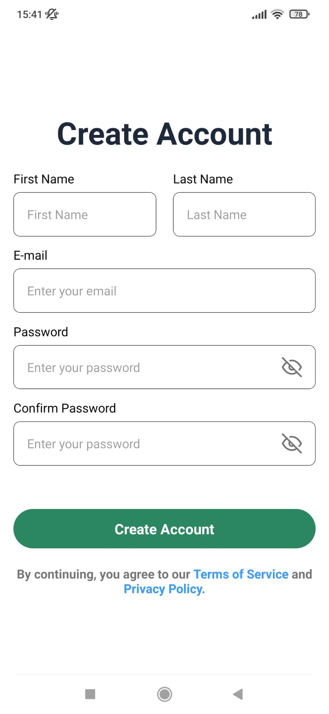
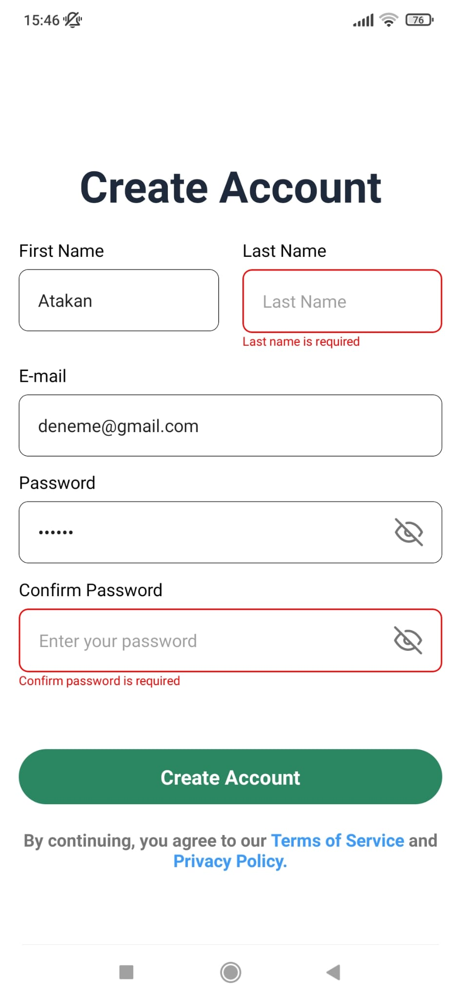
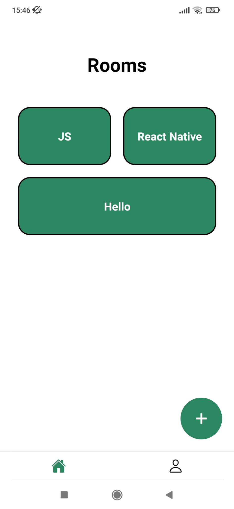

# Chatify

## Overview

**Chatify** is a simple chat application that allows users to create rooms, exchange messages in real-time, and perform email login/logout operations. It leverages Firebase Authentication and Realtime Database to provide a seamless real-time messaging experience.

## Project Preview

<div style="display: flex; flex-direction: row; justify-content: center;">
<div style="display: flex; flex-direction: row; margin-right: 20; margin-bottom: 20;">
    
  </div>
    <hr>
  <div style="display: flex; flex-direction: row; margin-right: 20; margin-bottom: 20;">
    
    
  </div>
  <div style="display: flex; flex-direction: row; margin-right: 20;margin-bottom: 20;"> 
    
     
  </div>
  <div style="display: flex; flex-direction: row; margin-right: 20;margin-bottom: 20;"> 
    
     
  </div>
  </div>

## Design Notice

The design is personally crafted, presenting a minimalistic layout for the basit chat application.

This chat application is developed using the following technologies and features:

## Features

- Room Creation and Joining: Users can create new rooms or join existing ones.
- Real-Time Messaging: Users can exchange text messages instantly within the selected room.
- Email Login/Logout: Secure email-based login and logout operations are performed using Firebase Authentication.
- Realtime Message Storage: Messages and rooms are stored and updated in real-time using Firebase Realtime Database.
- Message Replies: Users can reply to other messages, enhancing the interactivity of the chat.

## Technologies Used

- React Native: A widely-used JavaScript framework for building cross-platform mobile applications.
- Firebase: Firebase Authentication and Realtime Database services provide a robust and secure infrastructure.
- Formik and Yup: Formik simplifies form management, while Yup handles form validation, ensuring data consistency and user input accuracy.

## Getting Started

To run this project locally, follow these steps:

1. **Clone the repository:**

   ```bash
   git clone https://github.com/AtakanAlkn/Chatify.git


   ```

2. **Navigate to the project directory:**

   cd Chatify.git

3. **Install dependencies:**

   npm install
   or
   yarn install

4. **Start the development server:**

   npm start
   or
   yarn start

5. **Run on iOS or Android:**

   To run the app on iOS or Android simulators/emulators, use the following commands respectively:

   npm run ios
   npm run android
   or
   yarn ios
   yarn android

**Congratulations!**
You've successfully set up and started the project locally. Feel free to explore the code, make changes, and test new features.

**Troubleshooting**
If you encounter any issues during the setup process or while running the app, consider the following steps:

Double-check that you've correctly configured your environment variables in the .env file.
Ensure you have Node.js and npm (or yarn) installed on your system.
Make sure you have Xcode (for iOS development) or Android Studio (for Android development) properly set up.
Clear the npm or yarn cache and node_modules directory, then run the installation step again.
If the problem persists, please open an issue on our GitHub repository. We'll be glad to assist you!

## License

This repository is licensed under the [MIT License](LICENSE).

## Contact

If you have any questions, suggestions, or just want to connect, you can reach me at:

- Email: alkan.atakan@outlook.com
- LinkedIn: [Atakan Alkan](https://www.linkedin.com/in/atakanalkn/)
